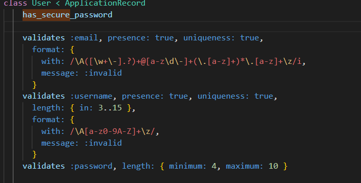
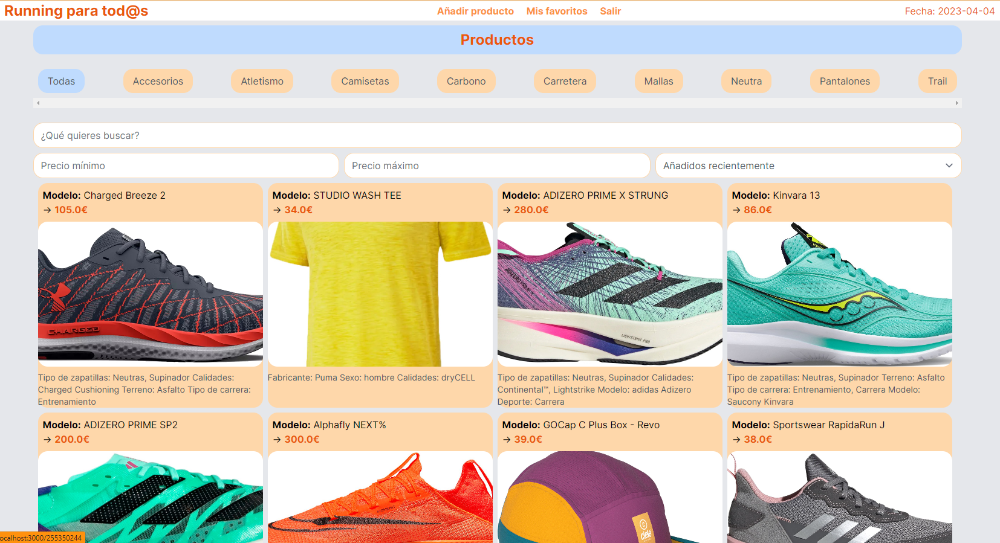

# Running_Para_Tod@s

## Ruby home page
* [Ruby](https://www.ruby-lang.org/es/)

## Download with Git
Clone the project
```bash
 https://github.com/rusgar/APP_Running
```
Go to the project directory
```bash
 cd mkdir "new"
```
First steps
 To install Rails, use the command provided by RubyGems gem install:
```bash
 gem install rails
 rails --version
```
```bash
 Rails new "mkdir" --d
```
Install dependencies and update
```bash
  bundle install
  bundle update
```

creation and migration
```bash
   rails db:create
   rails db:migrate
```
Start the server
```bash
   bin/dev
```

 ## Other dependencies
 * [Active Storage facilitates uploading files](https://edgeguides.rubyonrails.org/active_storage_overview.html)
 ```bash
  rails active_storage:install
```
* [A scaffold is a set of automatically generated files which forms the basic structure of a Rails project](https://www.rubyguides.com/2020/03/rails-scaffolding/)
```bash
  rails g scaffold
```
 
* [Get a strong password in emails](https://api.rubyonrails.org/v7.0.4/classes/ActiveModel/SecurePassword/ClassMethods.html)

  


 ## Tech Stack
**Client:** 
* [Tailwind CSS in Ruby on Rails](https://tailwindcss.com/docs/guides/ruby-on-rails)
```bash
  bundle add tailwindcss-rails
  rails tailwindcss:install
```


## Production environment
```bash
bundle lock --add-platform x64-mingw-ucrt
```

## Screenshots
 

